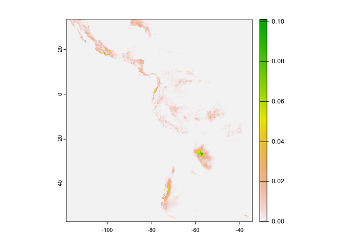

<!-- README.md is generated from README.Rmd. Please edit that file -->

# zendown

<!-- badges: start -->

[](https://github.com/rfsaldanha/zendown/actions/workflows/R-CMD-check.yaml)

<!-- badges: end -->

Access, download and locally cache files deposited on Zenodo easily.

## Installation

You can install the development version of zendown from GitHub with:

``` r
# install.packages("remotes")
remotes::install_github("rfsaldanha/zendown")
```

## Example

``` r
library(zendown)
```

This [Zenodo deposit](https://zenodo.org/records/10959197) contains RDS
files from examples datasets.

First, you need to find the Zenodo deposit code. It is the number that
appears on the end of a Zenodo deposit link. The code number also
appears on the Zenodo DOI.

    https://zenodo.org/records/10959197

Deposition code: 10959197

With the deposit code and the desired file name, you can just access the
file with the `zen_file` function.

``` r
my_iris <- zen_file(deposit_id = 10959197, file_name = "iris.rds") |>
  readRDS()

head(my_iris)
#>   Sepal.Length Sepal.Width Petal.Length Petal.Width Species
#> 1          5.1         3.5          1.4         0.2  setosa
#> 2          4.9         3.0          1.4         0.2  setosa
#> 3          4.7         3.2          1.3         0.2  setosa
#> 4          4.6         3.1          1.5         0.2  setosa
#> 5          5.0         3.6          1.4         0.2  setosa
#> 6          5.4         3.9          1.7         0.4  setosa
```

The function will create a cache on your machine with all accessed
files, avoiding re-downloading them when you access some file again.

## Cache

By default, the cache is stored on a temporary folder that is cleaned
when the R session is ended.

To use a persistent cache, available across sessions and reboots, you
can set an environment variable. First, edit your environment
configuration file with.

``` r
usethis::edit_r_environ()
```

And add the following line:

``` r
zendown_cache_type = "persistent"
```

Save the file and restart R. On RStudio: Session -\> Restart R

After this, all cache will be persistent. The package provides a
functions to delete a specific Zenodo deposit cache `?delete_mirror`.

## More examples

``` r
# https://zenodo.org/records/10848
zen_file(10848, "DOAJ_Soc_Licenses_Correct.csv") |>
  read.csv2() |>
  tibble::tibble() |>
  head()
#> # A tibble: 6 × 12
#>       X DOAJNR Title Title.Alternative Identifier Publisher Language ISSN  EISSN
#>   <int>  <int> <chr> <chr>             <chr>      <chr>     <chr>    <chr> <chr>
#> 1     1     37 "Est…  <NA>             http://ww… "Univers… Spanish… 1405… <NA> 
#> 2     2     65 "Rev… "Review of Resea… http://rc… "Expert … English… 1583… 1584…
#> 3     3     85 "Soc…  <NA>             http://ej… "Firenze… English… 2038… <NA> 
#> 4     4    106 "Jou…  <NA>             http://jf… "New Pra… English  1945… 1944…
#> 5     5    195 "Oñ…  <NA>             http://op… "Oñati … English… 2079… <NA> 
#> 6     6    198 "Soc…  <NA>             http://so… "Associa… French   1950… <NA> 
#> # ℹ 3 more variables: CC.License.Doaj <chr>, CC.License.Checked <chr>,
#> #   Wrong.Cat.Doaj <chr>
```

``` r
# https://zenodo.org/records/10947952
zen_file(10947952, "2m_temperature_max.parquet") |>
  arrow::read_parquet() |>
  tibble::tibble() |>
  head()
#> # A tibble: 6 × 4
#>   code_muni date       name                    value
#>       <int> <date>     <chr>                   <dbl>
#> 1   1100015 2023-01-01 2m_temperature_max_mean  304.
#> 2   1100015 2023-01-02 2m_temperature_max_mean  302.
#> 3   1100015 2023-01-03 2m_temperature_max_mean  302.
#> 4   1100015 2023-01-04 2m_temperature_max_mean  302.
#> 5   1100015 2023-01-05 2m_temperature_max_mean  297.
#> 6   1100015 2023-01-06 2m_temperature_max_mean  302.
```

``` r
# https://zenodo.org/records/10889682
zen_file(10889682, "total_precipitation_2023-09-01_2023-09-30_day_sum.nc") |>
  terra::rast() |>
  terra::plot(1)
```



## zen4R

To explore the Zenodo API possibilities to problematically store files
and other procedures, check the
[zen4R](https://github.com/eblondel/zen4R) package.
